# Lab7Web

Afrizal fajrianto (312210449)

Teknik Informatika - UNIVERSITAS PELITA BANGSA
______________________________________________

## MELAKUKAN INSTALL PADA XAMPP

Untuk dapat menginstall Xampp kalian dapat menggunakan link ini https://www.apachefriends.org/download.html pada google, dan kemudian setelah terbuka kalian dapat memilih beberapa versi yang sesuai dengan laptop kalian. Dan pilihlah versi portable untuk memudahkan terjadinya proses instalasi nantinya.

Setelah itu kalian dapat melakukan Extract File tersebut dengan menyesuaikan lokasi penyimpanannya seperti gambar dibawah.

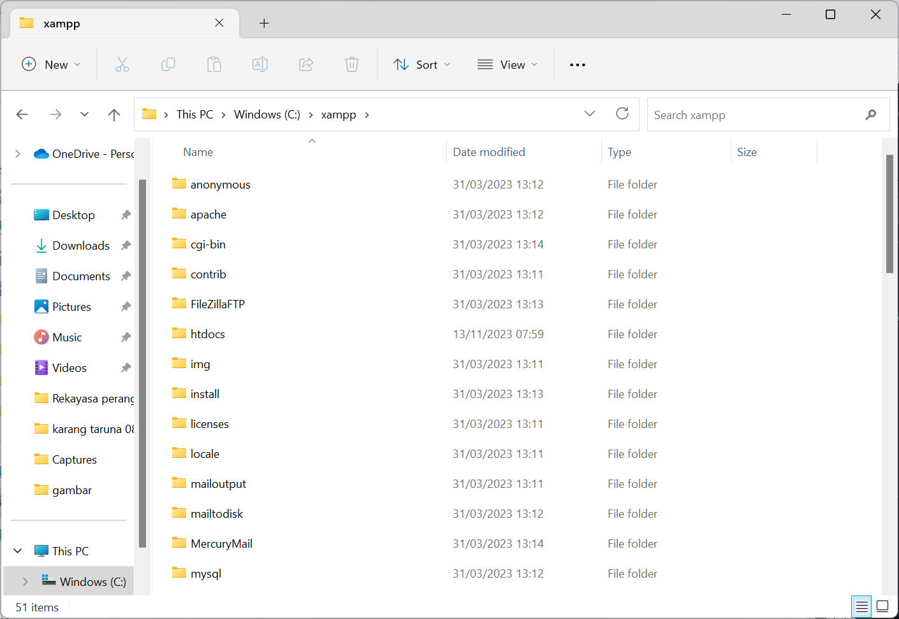


## PROSES MENJALANKAN XAMPP

Untuk dapat menjalankan Xampp ini kalian perlu membukanya terlebih dulu, setelah itu kalian klik tombol start pada bagian server Apache, dan tampilan utama Xampp seperti gambar dibaawah ini jika berhasil.

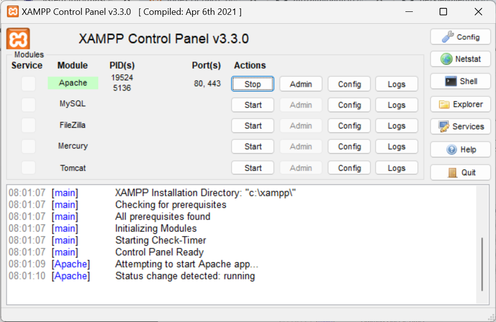


## MEMULAI PHP

Pertama, buatlah folder Lab7_php_dasar pada root directory web server (c:xampp/htdocs)

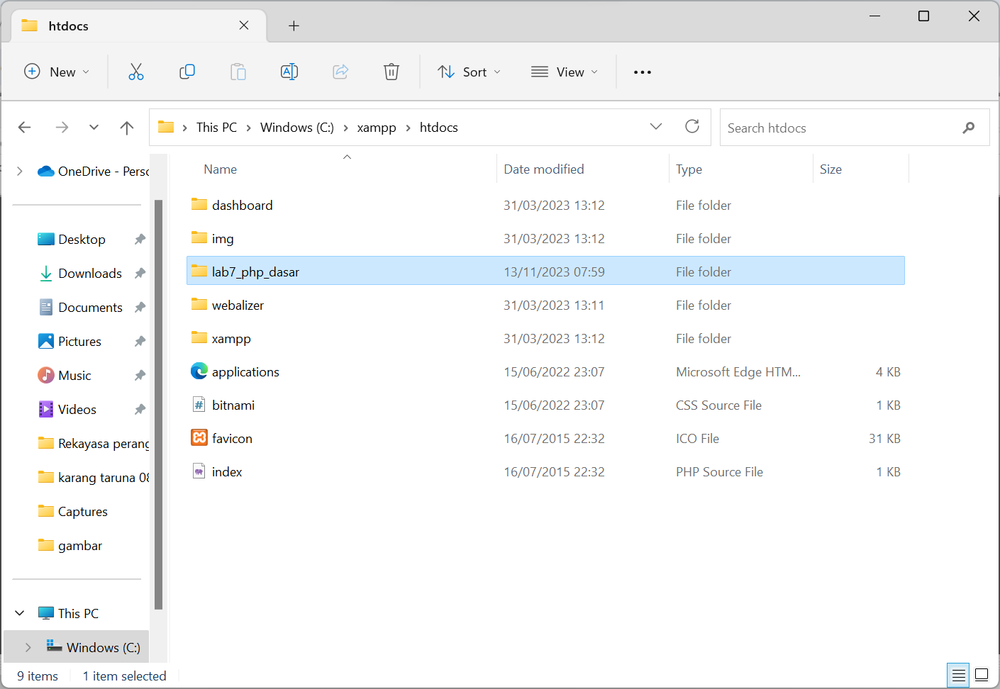

Setelahnya kalian dapat mengakses directory pada web server seperti gambar dibawah dengan menggunakan URL : http://localhost/lab7_php_dasar

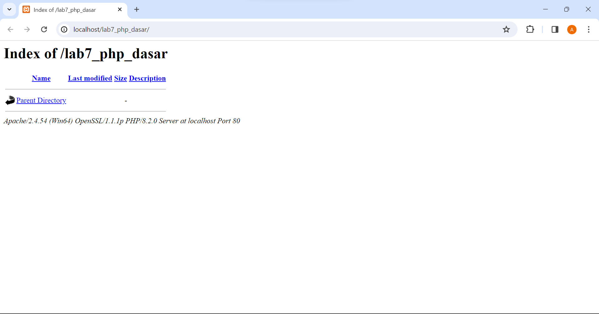


## PHP DASAR

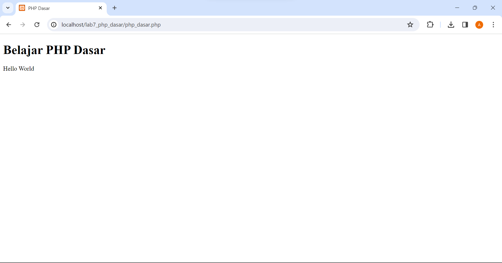

Untuk dapat mendapatkan tampilan seperti gambar diatas, buatlah file baru dengan nama php_dasar.php pada directory tersebut. Kemudian tambahkan kode berikut:

```php
<!DOCTYPE html>
<html lang="en">
<head>
    <meta charset="UTF-8">
    <title>PHP Dasar</title>
</head>
<body>
    <h1>Belajar PHP Dasar</h1>
    <?php
        echo "Hello World";
    ?>
</body>
</html>
```

## VARIABLE PHP

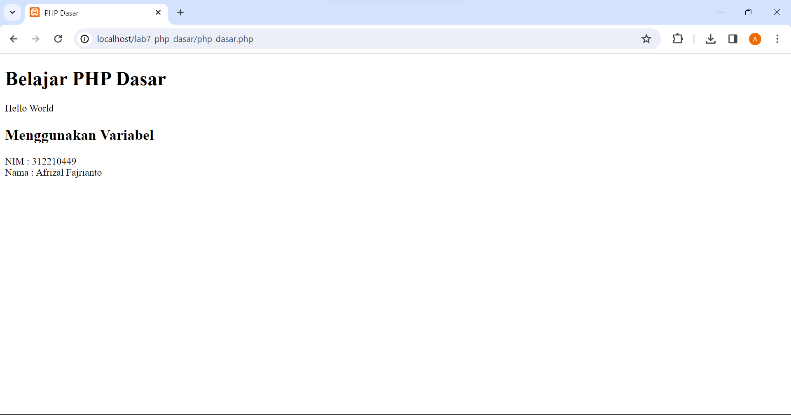

Untuk mendapatkan tampilan seperti diatas kalian bisa menambahkan kode berikut:

```php
<!-- Variabel PHP -->
<h2>Menggunakan Variabel</h2>
    <?php
        $nim = "312210449";
        $nama = 'Afrizal Fajrianto';
        echo "NIM : " . $nim . "<br>";
        echo "Nama : $nama";
    ?>
```

## PREDEFINE $_GET

Buatlah file baru dalam Directory Lab_php_dasar dengan nama file disini saya namakan dengan latihan2.php dan untuk mengaksesnya dapat menggunakan URL : http://localhost/lab7_php_dasar/latihan2.php?nama=%20Afrizal%20Fajrianto

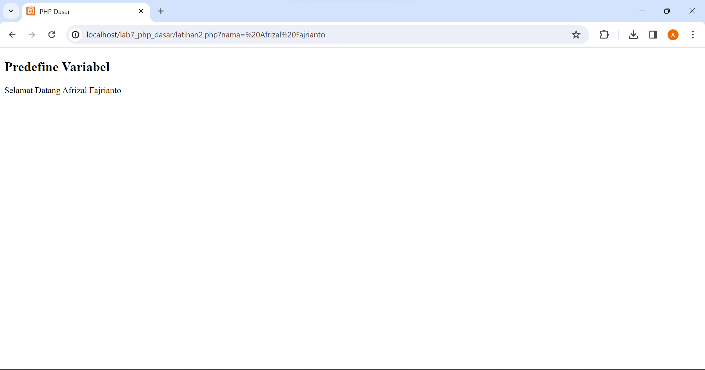

Berikut kode yang digunakan:

```php
<!DOCTYPE html>
<html lang="en">
<head>
    <meta charset="UTF-8">
    <meta http-equiv="X-UA-Compatible" content="IE=edge">
    <meta name="viewport" content="width=device-width, initial-scale=1.0">
    <title>PHP Dasar</title>
</head>
<body>
    <!-- Variabel $_GET -->
    <h2>Predefine Variabel</h2>
<?php
    echo 'Selamat Datang'. $_GET['nama'];
?>
</body>
</html>
```

## PEMBUATAN FORM INPUT DENGAN VARIABLE $_POST

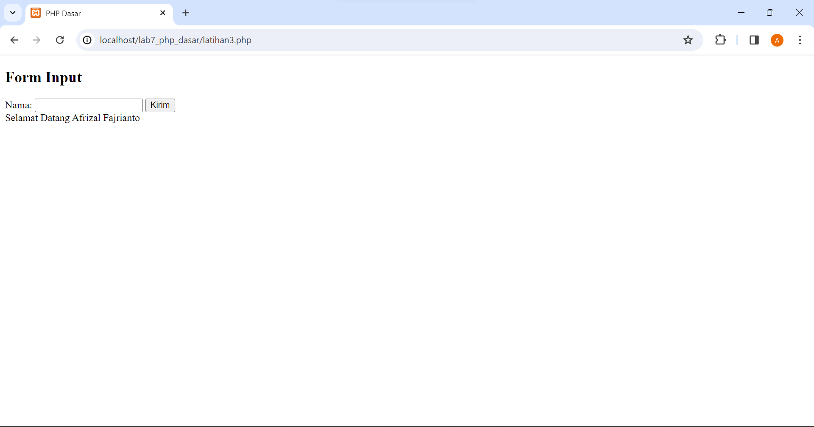

Untuk mendapat tampilan diatas, buatlah file baru dengan nama file disini saya namakan latihan3.php dalam directory Lab7_php_dasar. Kemudian tambahkan kode berikut:

```php
<!DOCTYPE html>
<html lang="en">
<head>
    <meta charset="UTF-8">
    <title>PHP Dasar</title>
</head>
<body>
<h2>Form Input</h2>
<form method="post">
    <label>Nama: </label>
    <input type="text" name="nama">
    <input type="submit" value="Kirim">
</form>
<?php
    echo 'Selamat Datang ' . $_POST['nama'];
?>
</body>
</html>
```

## OPERATOR

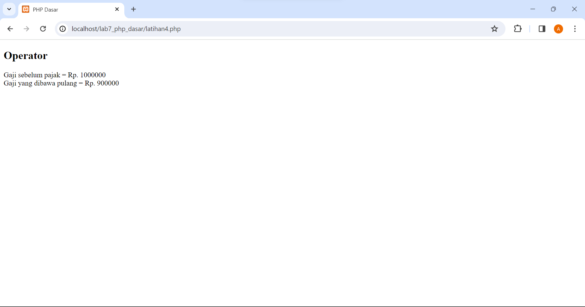

Untuk mendapat tampilan diatas, buatlah file baru dengan nama file disini saya namakan latihan4.php dalam directory Lab7_php_dasar. Kemudian tambahkan kode berikut:

```php
<!DOCTYPE html>
<html lang="en">
<head>
    <meta charset="UTF-8">
    <meta http-equiv="X-UA-Compatible" content="IE=edge">
    <meta name="viewport" content="width=device-width, initial-scale=1.0">
    <title>PHP Dasar</title>
</head>
<body>
<?php
    $gaji = 1000000;
    $pajak = 0.1;
    $thp = $gaji - ($gaji*$pajak);
        echo "Gaji sebelum pajak = Rp. $gaji <br>";
        echo "Gaji yang dibawa pulang = Rp. $thp";
?>
</body>
</html>
```

## KONDISI IF

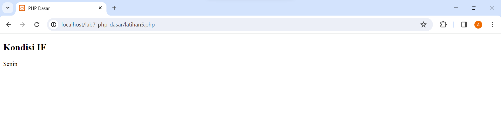

Untuk mendapat tampilan pengkondisian IF ELSE seperti diatas, buatlah file baru dengan nama file disini saya namakan latihan5.php dalam directory Lab7_php_dasar. Kemudian tambahkan kode berikut:

```php
<!DOCTYPE html>
<html lang="en">
<head>
    <meta charset="UTF-8">
    <meta http-equiv="X-UA-Compatible" content="IE=edge">
    <meta name="viewport" content="width=device-width, initial-scale=1.0">
    <title>PHP Dasar</title>
</head>
<body>
    <h2>Kondisi IF</h2>
<?php
    $nama_hari = date("l");
        if ($nama_hari == "Sunday") {
            echo "Minggu";
        } elseif ($nama_hari == "Monday") {
            echo "Senin";
        } else {
            echo "Selasa";
        }
?>
</body>
</html>
```

## KONDISI SWITCH

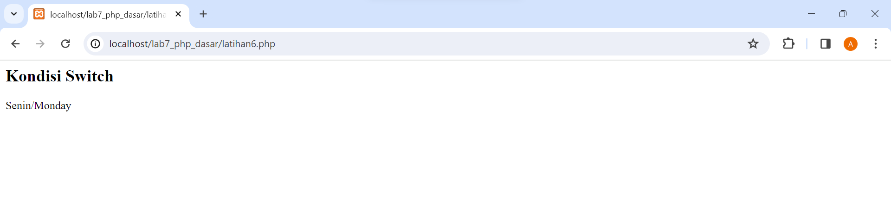

Untuk mendapat tampilan pengkondisian SWITCH CASE dengan break seperti diatas, buatlah file baru dengan nama file disini saya namakan latihan6.php dalam directory Lab7_php_dasar. Kemudian tambahkan kode berikut:

```php
<h2>Kondisi Switch</h2>
<?php
    $nama_hari = date("l");
    switch ($nama_hari) {
        case "Sunday":
            echo "Minggu";
            break;
        case "Monday":
            echo "Senin";
            break;
        case "Tuesday":
            echo "Selasa";
            break;
        default:
            echo "Sabtu";
    }
    echo"/$nama_hari";
?>
```

## PERULANGAN FOR

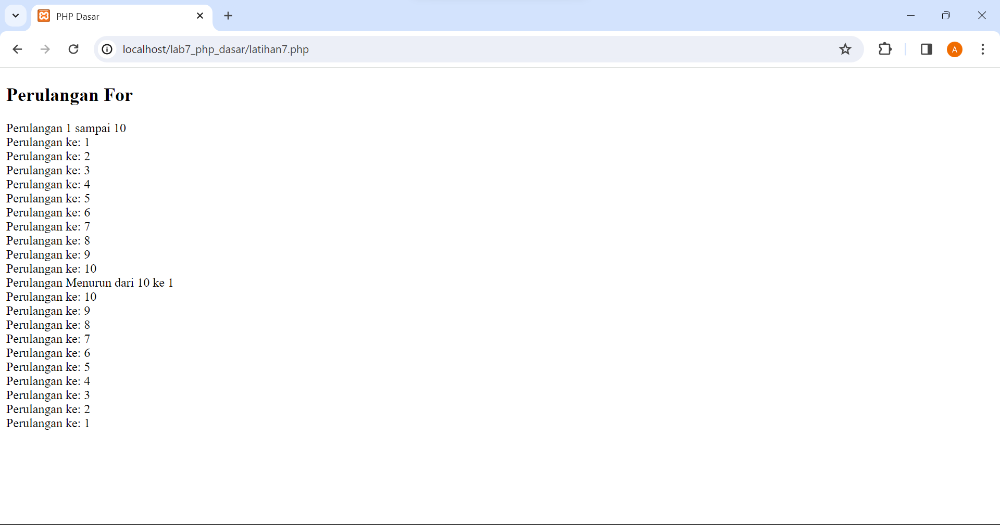

Untuk mendapat tampilan seperti diatas, buatlah file baru dengan nama file disini saya namakan latihan7.php dalam directory Lab7_php_dasar. Kemudian tambahkan kode berikut:

```php
<!DOCTYPE html>
<html lang="en">
<head>
    <meta charset="UTF-8">
    <meta http-equiv="X-UA-Compatible" content="IE=edge">
    <meta name="viewport" content="width=device-width, initial-scale=1.0">
    <title>PHP Dasar</title>
</head>
<body>
    <h2>Perulangan For</h2>
<?php
        echo "Perulangan 1 sampai 10 <br />";
    for ($i=1; $i<=10; $i++) {
        echo "Perulangan ke: " . $i . '<br />';
    }
        echo "Perulangan Menurun dari 10 ke 1 <br />";
    for ($i=10; $i>=1; $i--) {
        echo "Perulangan ke: " . $i . '<br />';
    }
?>
</body>
</html>
```

## PERULANGAN WHILE

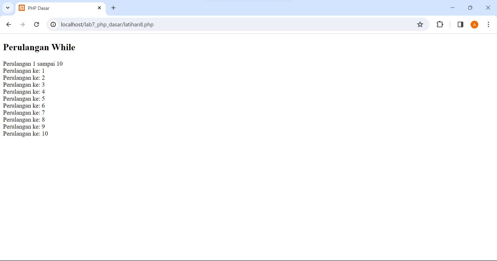

Untuk mendapat tampilan seperti diatas, buatlah file baru dengan nama file disini saya namakan latihan8.php dalam directory Lab7_php_dasar. Kemudian tambahkan kode berikut:

```php
<h2>Perulangan While</h2>
<?php
        echo "Perulangan 1 sampai 10 <br />";
        $i=1;
    while ($i<=10) {
        echo "Perulangan ke: " . $i . '<br />';
        $i++;
    }
?>
```

## PERULANGAN DOWHILE

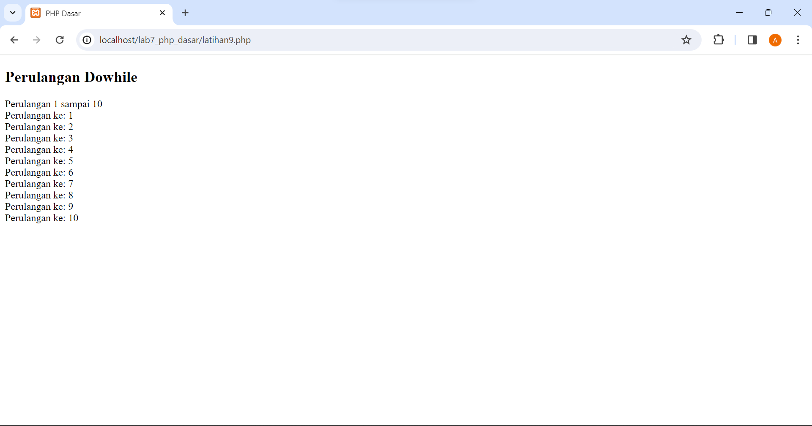

Untuk mendapat tampilan seperti diatas, buatlah file baru dengan nama file disini saya namakan latihan9.php dalam directory Lab7_php_dasar. Kemudian tambahkan kode berikut:

```php
<h2>Perulangan Dowhile</h2>
<?php
        echo "Perulangan 1 sampai 10 <br />";
        $i=1;
    do {
        echo "Perulangan ke: " . $i . '<br />';
        $i++;
        } while ($i<=10);
?>
```

# PERTANYAAN DAN TUGAS

Buatlah program PHP sederhana dengan menggunakan form input yang menampilkan nama , tanggal lahir dan pekerjaan . Kemudian tampilkan outputnya dengan menghitung umur berdasarkan inputan tanggal lahir . Dan pilihan pekerjaan dengan gaji yang berbeda-beda sesuai pilihan pekerjaan.

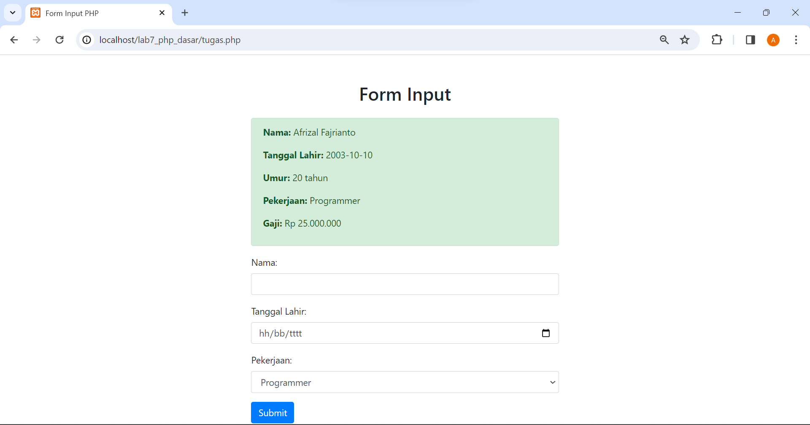

Note: Untuk kolom Tanggal Lahir gunakan format : 0000/00/00

```php
<!DOCTYPE html>
<html lang="en">
<head>
    <meta charset="UTF-8">
    <meta name="viewport" content="width=device-width, initial-scale=1.0">
    <title>Form Input PHP</title>
    <!-- Bootstrap CSS -->
    <link rel="stylesheet" href="https://stackpath.bootstrapcdn.com/bootstrap/4.3.1/css/bootstrap.min.css">
</head>
<body>

<div class="container mt-5">
    <div class="row justify-content-center">
        <div class="col-md-6">
            <h2 class="text-center mb-4">Form Input</h2>

            <?php
            // Fungsi untuk menghitung umur berdasarkan tanggal lahir
            function hitungUmur($tanggal_lahir) {
                $tanggal_lahir = new DateTime($tanggal_lahir);
                $sekarang = new DateTime('today');
                $umur = $sekarang->diff($tanggal_lahir);
                return $umur->y;
            }

            // Fungsi untuk menentukan gaji berdasarkan pekerjaan
            function hitungGaji($pekerjaan) {
                switch ($pekerjaan) {
                    case 'Programmer':
                        return 5000000;
                    case 'Desainer':
                        return 4500000;
                    case 'Marketing':
                        return 4000000;
                    default:
                        return 0;
                }
            }

            // Menangani form submission
            if ($_SERVER['REQUEST_METHOD'] === 'POST') {
                // Mengambil nilai dari form
                $nama = htmlspecialchars($_POST['nama']);
                $tanggal_lahir = htmlspecialchars($_POST['tanggal_lahir']);
                $pekerjaan = htmlspecialchars($_POST['pekerjaan']);

                // Menghitung umur
                $umur = hitungUmur($tanggal_lahir);

                // Menghitung gaji berdasarkan pekerjaan
                $gaji = hitungGaji($pekerjaan);

                // Menampilkan output
                echo "<div class='alert alert-success'>";
                echo "<p><strong>Nama:</strong> $nama</p>";
                echo "<p><strong>Tanggal Lahir:</strong> $tanggal_lahir</p>";
                echo "<p><strong>Umur:</strong> $umur tahun</p>";
                echo "<p><strong>Pekerjaan:</strong> $pekerjaan</p>";
                echo "<p><strong>Gaji:</strong> Rp " . number_format($gaji, 0, ',', '.') . "</p>";
                echo "</div>";
            }
            ?>

            <!-- Form Input -->
            <form method="post" action="">
                <div class="form-group">
                    <label for="nama">Nama:</label>
                    <input type="text" class="form-control" name="nama" required>
                </div>

                <div class="form-group">
                    <label for="tanggal_lahir">Tanggal Lahir:</label>
                    <input type="date" class="form-control" name="tanggal_lahir" required>
                </div>

                <div class="form-group">
                    <label for="pekerjaan">Pekerjaan:</label>
                    <select class="form-control" name="pekerjaan" required>
                        <option value="Programmer">Programmer</option>
                        <option value="Desainer">Desainer</option>
                        <option value="Marketing">Marketing</option>
                    </select>
                </div>

                <button type="submit" class="btn btn-primary">Submit</button>
            </form>
        </div>
    </div>
</div>

<!-- Bootstrap JS and dependencies -->
<script src="https://code.jquery.com/jquery-3.3.1.slim.min.js"></script>
<script src="https://cdnjs.cloudflare.com/ajax/libs/popper.js/1.14.7/umd/popper.min.js"></script>
<script src="https://stackpath.bootstrapcdn.com/bootstrap/4.3.1/js/bootstrap.min.js"></script>

</body>
</html>

```

SELESAI.

